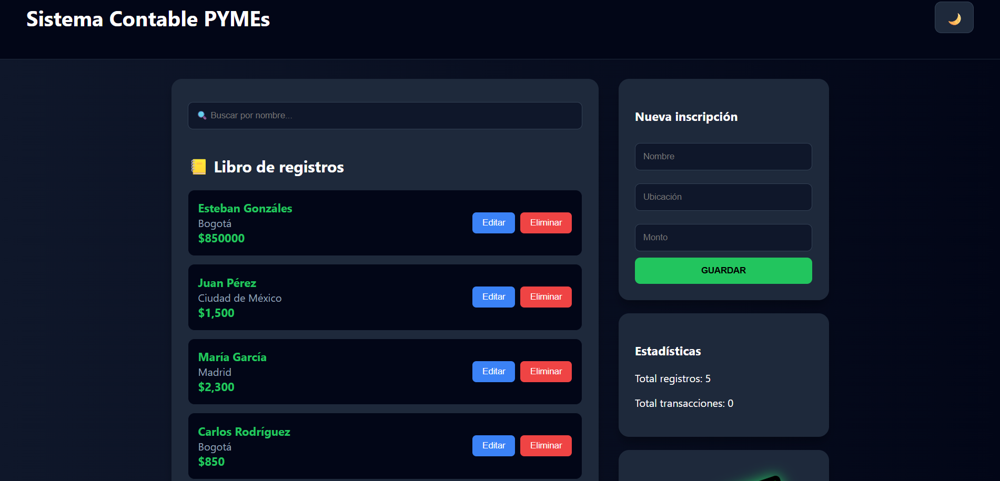
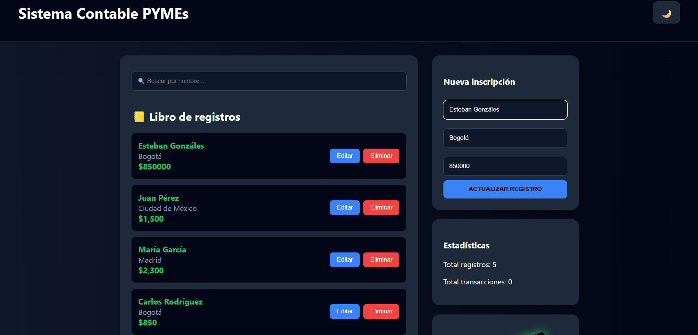
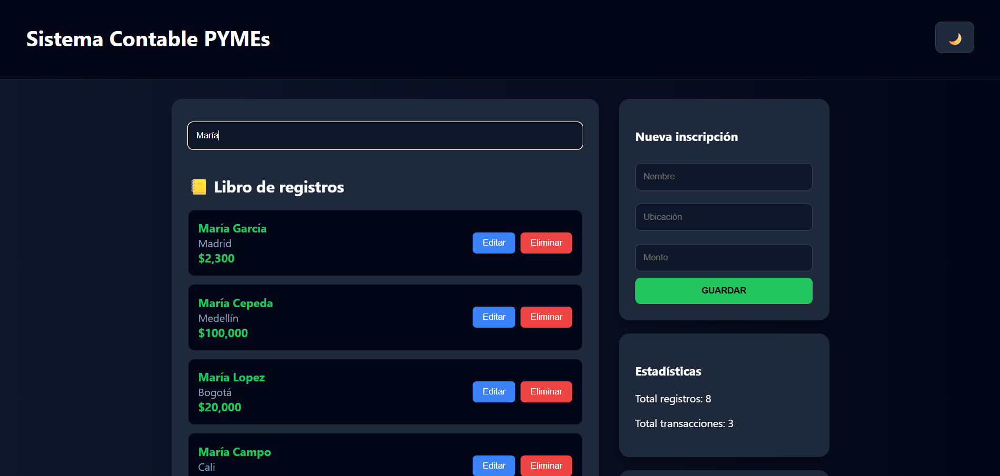
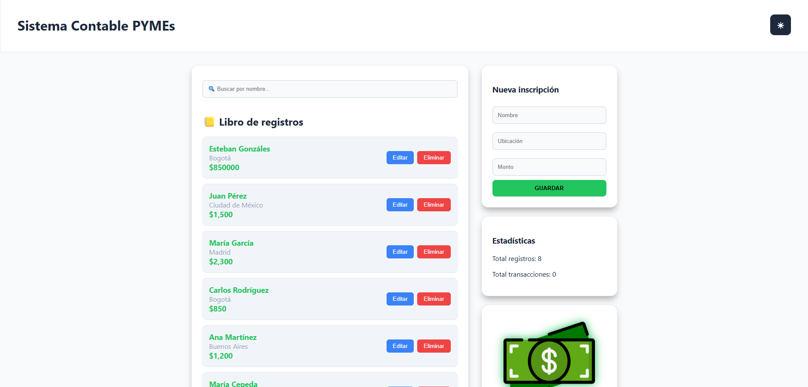

📋 Descripción
Aplicación web para gestionar registros contables de una pequeña o mediana empresa (PYME).

Permite registrar:

💰 Ingresos

💸 Gastos

📄 Facturas

🏛️ Impuestos

Funcionalidades Principales
✔ Crear registros contables

✔ Listar registros

✔ Editar registros

✔ Eliminar registros

✔ Marcar como activo/inactivo

✔ Filtrar por categoría

✔ Filtrar por prioridad

✔ Buscar registros

✔ Ver estadísticas

✔ Guardar datos en LocalStorage

Características Técnicas
✔ JavaScript puro (ES2023)

✔ No se usaron frameworks

✔ Uso de programación funcional e inmutabilidad

✔ Uso intensivo de métodos de arrays (map, filter, reduce)

✔ Uso de Spread Operator para la actualización de estados

💡 Adaptación al Dominio Contable
Concepto Genérico → Adaptación Contable

Elemento → Movimiento Contable

Propiedades del Objeto:

name → Nombre del movimiento

description → Descripción

category → Tipo (Ingreso, Gasto, Factura, Impuesto)

priority → Prioridad

active → Activo / Inactivo

createdAt → Fecha de creación

🏗️ Estructura del Proyecto
Plaintext
3-proyecto/
│
├── README.md
│
├── index.html
│
├── styles.css
│
└── script.js
📝 Modelo de Datos
Ejemplo de un registro contable generado por el sistema:

JavaScript
{
  id: 173445353535,
  name: "Pago de cliente",
  description: "Pago por servicio web",
  active: true,
  priority: "high",
  category: "income",
  createdAt: "2026-02-17",
  updatedAt: null
}
🔧 Funciones Implementadas
Persistencia

loadItems() → Carga los datos desde LocalStorage al iniciar.

saveItems() → Persiste la lista de movimientos contables.

CRUD & Lógica

createItem() → Genera un nuevo movimiento contable.

updateItem() → Edita la información de un registro existente.

deleteItem() → Elimina registros de forma definitiva.

toggleItemActive() → Cambia el estado de Activo a Inactivo.

Filtros y Búsqueda

filterByCategory(), filterByPriority() y searchItems() para localización rápida de datos.

Estadísticas

getStats() y renderStats() para mostrar totales y conteos en tiempo real.

### 🎨 Interfaz de Usuario e Impacto Visual
Evidencias del Sistema:

**Pantallazo 1 (Interfaz General):**

**Pantallazo 2 (Edición):**6

**Pantallazo 3 (Buscador):**

**Pantallazo 4 (Modo Claro):**

Estados Visuales:

Activo: Visualización normal.

Inactivo: Opacidad reducida para distinguir movimientos cerrados.

Categorías con Iconos: 💰 Ingreso, 💸 Gasto, 📄 Factura, 🏛️ Impuesto.

✅ Criterios Cumplidos
✔ Funcionalidad: Crear, Editar, Eliminar, Activar/Desactivar, Filtrar y Buscar.

✔ Código: Implementación de Spread Operator, Map, Filter y Reduce bajo principios de inmutabilidad.

✔ Persistencia: LocalStorage operativo con estadísticas dinámicas.

🚀 Cómo Funciona
El usuario ingresa los datos en el formulario (Nombre, Ubicación/Descripción, Monto/Categoría).

Se crea un objeto inmutable.

Se guarda automáticamente en LocalStorage.

Se renderiza en la lista principal y se actualizan las Estadísticas al instante.